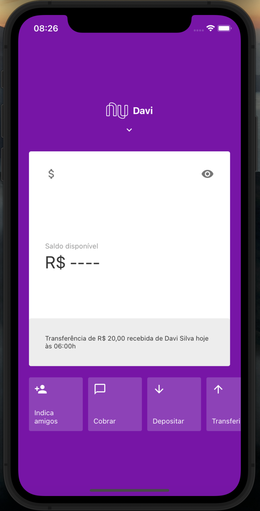
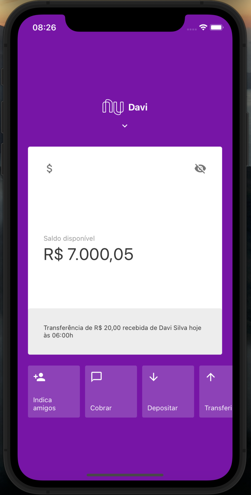
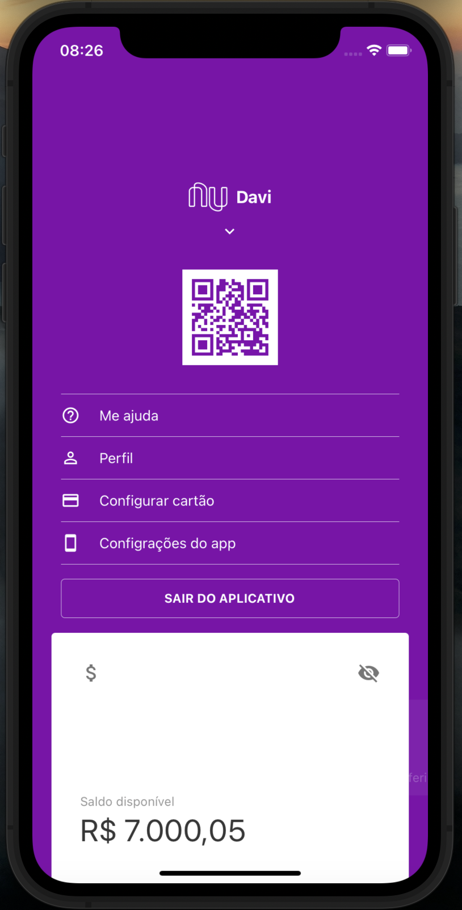

<div align="center" id="top">
  

&#xa0;

</div>

<h1 align="center">Nubank Clone</h1>

<br>

## :dart: About

Nubank screen clone project

## Screenshots

<div style="display: flex; gap: 10px;">

  

  

  

</div>

## :rocket: Technologies

The following tools were used in this project:

- [Expo](https://expo.io/)
- [Node.js](https://nodejs.org/en/)
- [React](https://pt-br.reactjs.org/)
- [React Native](https://reactnative.dev/)
- [React QRCode](https://github.com/awesomejerry/react-native-qrcode-svg)
- [React Animated](https://reactnative.dev/docs/animated)

## :white_check_mark: Requirements

Before starting :checkered_flag:, you need to have [Git](https://git-scm.com) and [Node](https://nodejs.org/en/) installed.

## :checkered_flag: Starting

```bash
# Clone this project
$ git clone https://github.com/davi1985/nubank-clone

# Access
$ cd nubank-clone

# Install dependencies
$ yarn

# Run the project
$ yarn start

# The server will initialize in the <http://localhost:3000>
```

Made with :heart: by <a href="https://github.com/davi1985" target="_blank">Davi Silva</a>

&#xa0;

<a href="#top">Back to top</a>
